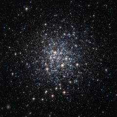
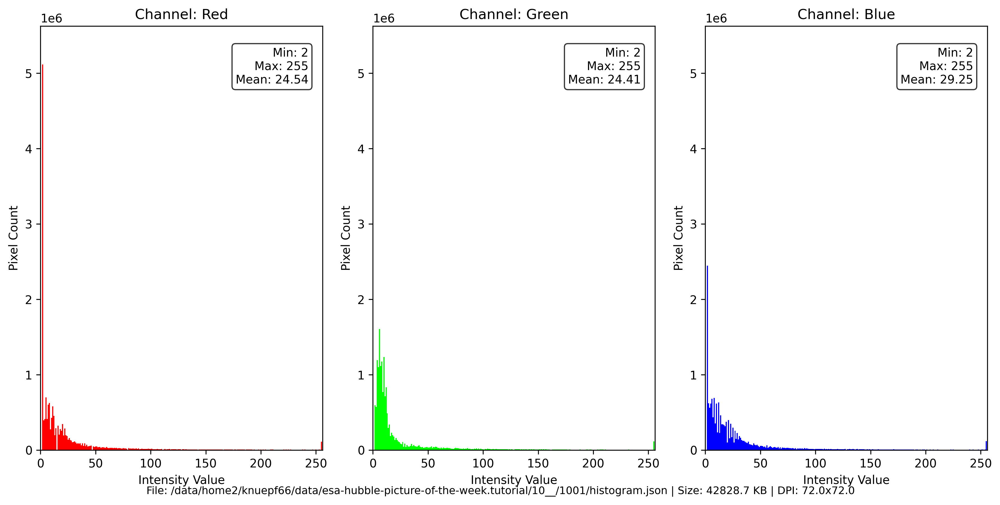

# Preview of potw1001a: "Messier 72, a celestial city from above"
[https://www.spacetelescope.org/images/potw1001a/](https://www.spacetelescope.org/images/potw1001a/)

As the first in the new weekly series of spectacular images from the NASA/ESA Hubble Space Telescope, the Hubble Picture of the Week, ESA/Hubble presents a stunning image of an unfamiliar star cluster. This rich collection of scattered stars, known as Messier 72, looks like a city seen from an airplane window at night, as small glints of light from suburban homes dot the outskirts of the bright city centre. Messier 72 is actually a globular cluster, an ancient spherical collection of old stars packed much closer together at its centre, like buildings in the heart of a city compared to less urban areas. As well as huge numbers of stars in the cluster itself the picture also captures the images of many much more distant galaxies seen between and around the cluster stars. French astronomer Pierre Méchain discovered this rich cluster in August of 1780, but we take Messier 72’s most common name from Méchain’s colleague Charles Messier, who recorded it as the 72nd entry in his famous catalogue of comet-like objects just two months later. This globular cluster lies in the constellation of Aquarius (the Water Bearer) about 50 000 light-years from Earth. This striking image was taken with the Wide Field Channel of the Advanced Camera for Surveys on the NASA/ESA Hubble Space Telescope. The image was created from pictures taken through yellow and near-infrared filters (F606W and F814W). The exposure times were about ten minutes per filter and the field of view is about 3.4 arcminutes across.

# Histogram

