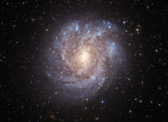

# Preview of potw1002a: "The dusty beauty of NGC 2082"
[https://www.spacetelescope.org/images/potw1002a/](https://www.spacetelescope.org/images/potw1002a/)

The richly textured spiral galaxy NGC 2082 is found about 60 million light-years away in the constellation of Dorado (the Swordfish), deep in the southern sky. As seen here in a very detailed image from the Advanced Camera for Surveys on the NASA/ESA Hubble Space Telescope, filaments of dark dust splay across NGC 2082’s luminous curved arms and dense central bulge of stars. Hubble’s sharp vision also reveals many of the individual bright blue stars dotting the galaxy’s rather ragged spiral arms as well as many much more distant galaxies in the background. This galaxy is faintly visible in backyard telescopes and was first recorded by Sir John Herschel during his visit to the Cape of Good Hope in South Africa in the 1830s. NGC 2082 was also the host of a bright supernova that was spotted by the great visual supernova discoverer Rev R. Evans back in 1992. This picture was created from images taken through blue and near-infrared filters (F435W and F814W) using the Wide Field Channel of the Advanced Camera for Surveys. The total exposure time was 19 minutes per filter and the field of view is about 2.2 x 1.6 arcminutes in size.