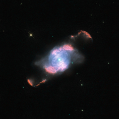

# Preview of potw1003a: "IC4634’s Glowing Waves"
[https://www.spacetelescope.org/images/potw1003a/](https://www.spacetelescope.org/images/potw1003a/)

This striking Hubble image of the planetary nebula IC 4634 reveals two shining, S-shaped ejections from a dying star. This star, awash in glowing material at the centre of the picture, bloated as it aged and launched its outer layers off into space. The star’s very hot, exposed core has since beamed intense ultraviolet radiation at these lost shells of gas, making them glow in rich colours. This process has been far from orderly or calm, however, as revealed by the distinct, separate waves of thrown-off gases. One is more distant and therefore was spewed first, followed by a more recently ejected tide of matter that formed the tighter S-shape. The result is remarkably symmetric on each side of the central star. The NASA/ESA Hubble Space Telescope’s Wide Field Planetary Camera 2 (WFPC2) captured this image of IC 4634, which is found more than about 7500 light-years away in the constellation of Ophiuchus (the Serpent Holder). IC 4634 and other objects like it are known as planetary nebulae due to their appearance through early telescopes as rounded, faintly luminous discs similar to the distant planets Uranus and Neptune. The picture was created from images through five different filters (F487N, F502N, F574M, F656N and F658N) that captured light emitted by different elements in the gaseous features. The total aggregate exposure time was 4000 seconds and the field of view is just 29 arcseconds across.