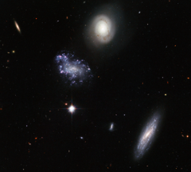

# Preview of potw1004a: "A clump of galaxy misfits"
[https://www.spacetelescope.org/images/potw1004a/](https://www.spacetelescope.org/images/potw1004a/)

That galaxies come in very different shapes and sizes is dramatically demonstrated by this striking Hubble image of the Hickson Compact Group 59. Named by astronomer Paul Hickson in 1982, this is the 59th such collection of galaxies in his catalogue of unusually close groups. What makes this image interesting is the variety on display. There are two large spiral galaxies, one face-on with smooth arms and delicate dust tendrils, and one highly inclined, as well as a strangely disorderly galaxy featuring clumps of blue young stars. We can also see many apparently smaller, probably more distant, galaxies visible in the background. Hickson groups display many peculiarities, often emitting in the radio and infrared and featuring active star-forming regions. In addition their galaxies frequently contain Active Galactic Nuclei powered by supermassive black holes, as well large quantities of dark matter. The NASA/ESA Hubble Space Telescope's Advanced Camera for Surveys, using the Wide Field Channel, captured this image of HCG059 in 2007. The picture was created from images taken through blue, yellow and near-infrared filters (F435W, F606W and F814W). The total exposure times per filter were 57 minutes, 41 minutes and 35 minutes respectively. The field of view is about 3.4 arcminutes across.