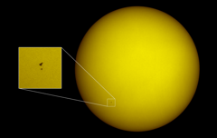

# Preview of potw1005a: "Hubble on the face of the Sun"
[https://www.spacetelescope.org/images/potw1005a/](https://www.spacetelescope.org/images/potw1005a/)

This remarkable and unique image of the space shuttle Atlantis and the NASA/ESA Hubble Space Telescope silhouetted against the dazzling disc of the Sun was captured from the ground near the start of the Servicing Mission 4 on 13 May 2009. The picture was taken from Florida, 100 kilometres south of the Kennedy Space Center as Hubble was about to be grappled by the Shuttle’s robot arm. The Shuttle and Hubble appear as small black specks at the lower left, the Shuttle is the larger of the two. The solar disc was unusually quiet in a deep solar minimum and there are no sunspots visible. The image was acquired with a 130 mm aperture refracting telescope equipped with a special solar prism to reduce the intensity along with a standard digital camera. The transit across the disc of the Sun took less than one second and the path across the ground where it could be observed was only a few kilometres wide — giving some idea of the extraordinarily careful planning needed.