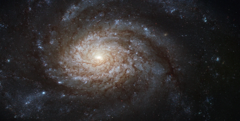

# Preview of potw1006a: "NGC 3810: A picture-perfect spiral"
[https://www.spacetelescope.org/images/potw1006a/](https://www.spacetelescope.org/images/potw1006a/)

The bright galaxy NGC 3810 demonstrates classical spiral structure in this very detailed image from Hubble. The bright central region is thought to be forming many new stars and is outshining the outer areas of the galaxy by some margin. Further out the galaxy displays strikingly rich dust clouds along its spiral arms. A close look shows that Hubble’s sharp vision also allows many individual stars to be seen. Hot young blue stars show up in giant clusters far from the centre and the arms are also littered with bright red giant stars. The original images were acquired by astronomers studying a supernova discovered late in the year 2000. It was the second supernova found in the galaxy in quick succession following another discovered in 1997. NGC 3810 is located about 50 million light-years from Earth in the constellation of Leo (the lion). It was discovered by William Herschel in 1784 and is easily seen as a faint smudge in small telescopes. The NASA/ESA Hubble Space Telescope's Advanced Camera for Surveys captured this image of NGC 3810. It was observed through three filters letting through blue, green and near-infrared list respectively (F435W, F555W and F814W). The exposure times were about seven minutes per filter and the field of view is about 3.4 x 1.7 arcminutes.