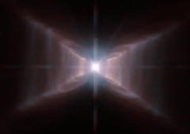

# Preview of potw1007a: "The unique Red Rectangle: sharper than ever before"
[http://www.spacetelescope.org/images/potw1007a/](http://www.spacetelescope.org/images/potw1007a/)

The star HD 44179 is surrounded by an extraordinary structure known as the Red Rectangle. It acquired its moniker because of its shape and its apparent colour when seen in early images from Earth. This strikingly detailed new Hubble image reveals how, when seen from space, the nebula, rather than being rectangular, is shaped like an X with additional complex structures of spaced lines of glowing gas, a little like the rungs of a ladder. The star at the centre is similar to the Sun, but at the end of its lifetime, pumping out gas and other material to make the nebula, and giving it the distinctive shape. It also appears that the star is a close binary that is surrounded by a dense torus of dust — both of which may help to explain the very curious shape. Precisely how the central engine of this remarkable and unique object spun the gossamer threads of nebulosity remains mysterious. It is likely that precessing jets of material played a role. The Red Rectangle is an unusual example of what is known as a proto-planetary nebula. These are old stars, on their way to becoming planetary nebulae. Once the expulsion of mass is complete a very hot white dwarf star will remain and its brilliant ultraviolet radiation will cause the surrounding gas to glow. The Red Rectangle is found about 2 300 light-years away in the constellation Monoceros (the Unicorn). The High Resolution Channel of the NASA/ESA Hubble Space Telescope’s Advanced Camera for Surveys captured this view of HD 44179 and the surrounding Red Rectangle nebula — the sharpest view so far. Red light from glowing Hydrogen was captured through the F658N filter and coloured red. Orange-red light over a wider range of wavelengths through a F625W filter was coloured blue. The field of view is about 25 by 20 arcseconds.