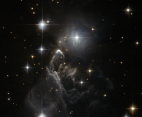

# Preview of potw1008a: "A lucky observation of an enigmatic cloud"
[https://www.spacetelescope.org/images/potw1008a/](https://www.spacetelescope.org/images/potw1008a/)

The little-known nebula IRAS 05437+2502 billows out among the bright stars and dark dust clouds that surround it in this striking image from the Hubble Space Telescope. It is located in the constellation of Taurus (the Bull), close to the central plane of our Milky Way galaxy. Unlike many of Hubble’s targets, this object has not been studied in detail and its exact nature is unclear. At first glance it appears to be a small, rather isolated, region of star formation and one might assume that the effects of fierce ultraviolet radiation from bright young stars probably were the cause of the eye-catching shapes of the gas. However, the bright boomerang-shaped feature may tell a more dramatic tale. The interaction of a high velocity young star and the cloud of gas and dust may have created this unusually sharp-edged bright arc. Such a reckless star would have been ejected from the distant young cluster where it was born and would travel at 200 000 km/hour or more through the nebula. This faint cloud was originally discovered in 1983 by the Infrared Astronomical Satellite (IRAS), the first space telescope to survey the whole sky in the infrared. IRAS was run by the United States, the Netherlands, and the United Kingdom and found huge numbers of new objects that were invisible from the ground. This image was taken with the Wide Field Channel of the Advanced Camera for Surveys on Hubble. It was part of a “snapshot” survey. These are lists of observations that are fitted into Hubble’s busy schedule when possible, without any guarantee that the observation will take place — so it was fortunate that the observation was made at all! This picture was created from images taken through yellow (F606W) and near-infrared (F814W) filters. The exposure times were about eleven minutes per filter and the field of view is about 100 arcseconds across. Links  Sahai, R., Claussen, M., Morris, M.,  & Ainsworth, R. 2009, Bulletin of the American Astronomical Society, 41, 456 Rosen, A., Sahai, R., Claussen, M.,  & Morris, M.  2010, Bulletin of the American Astronomical Society, 41, 264 