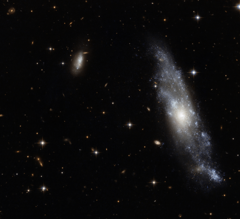

# Preview of potw1009a: "A fine Hydra spiral"
[https://www.spacetelescope.org/images/potw1009a/](https://www.spacetelescope.org/images/potw1009a/)

The small spiral galaxy NGC 2758 is captured in great detail in this image from the Advanced Camera for Surveys (ACS) on the NASA/ESA Hubble Space Telescope. It was first seen by the American astronomer Frank Muller, at the McCormick Observatory in Virginia in the 1880s. This galaxy lies in the constellation of Hydra (the Sea Serpent), the largest and longest constellation in the sky. This very sharp Hubble image shows many of the bright blue stars within the galaxy’s loosely wound spiral arms as well as a bright companion dwarf galaxy to the upper left. Many more distant galaxies lie in the background. NGC 2758 is a fine example of a spiral galaxy that is close enough for the structure to be seen very clearly. In this case the Hubble images were obtained as part of a study of the central redder “bulge” component of galaxies and how they form and evolve. This picture was created from ACS Hubble images taken through blue (F435W) and near-infrared (F814W) filters. The exposure times were 1050 s per filter and the field of view was about 3.4 arcminutes across.