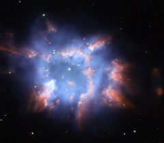

# Preview of potw1010a: "A star's colourful final splash"
[https://www.spacetelescope.org/images/potw1010a/](https://www.spacetelescope.org/images/potw1010a/)

The Hubble Space Telescope captured this beautiful image of NGC 6326, a planetary nebula with glowing wisps of outpouring gas that are lit up by a central star nearing the end of its life. When a star ages and the red giant phase of its life comes to an end, it starts to eject layers of gas from its surface leaving behind a hot and compact white dwarf. Sometimes this ejection results in elegantly symmetric patterns of glowing gas, but NGC 6326 is much less structured. This object is located in the constellation of Ara, the Altar, about 11 000 light-years from Earth. Planetary nebulae are one of the main ways in which elements heavier than hydrogen and helium are dispersed into space after their creation in the hearts of stars. Eventually some of this outflung material may form new stars and planets. The vivid red and blue hues in this image come from the material glowing under the action of the fierce ultraviolet radiation from the still hot central star. This picture was created from images taken using the Hubble Space Telescope’s Wide Field Planetary Camera 2. The red light was captured through a filter letting through the glow from hydrogen gas (F658N). The blue glow comes from ionised oxygen and was recorded through a green filter (F502N). The green layer of the image, which shows the stars well, was taken through a broader yellow filter (F555W). The total exposure times were 1400 s, 360 s and 260 s respectively. The field of view is about 30 arcseconds across.