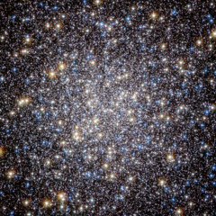

# Preview of potw1011a: "The crowded heart of the Hercules globular cluster"
[https://www.spacetelescope.org/images/potw1011a/](https://www.spacetelescope.org/images/potw1011a/)

This image, taken by the Advanced Camera for Surveys on the Hubble Space Telescope, shows the core of the great globular cluster Messier 13 and provides an extraordinarily clear view of the hundreds of thousands of stars in the cluster, one of the brightest and best known in the sky. Just 25 000 light-years away and about 145 light-years in diameter, Messier 13 has drawn the eye since its discovery by Edmund Halley, the noted British astronomer, in 1714. The cluster lies in the constellation of Hercules and is so bright that under the right conditions it is even visible to the unaided eye. As Halley wrote: “This is but a little Patch, but it shews it self to the naked Eye, when the Sky is serene and the Moon absent.” Messier 13 was the target of a symbolic Arecibo radio telescope message that was sent in 1974, communicating humanity’s existence to possible extraterrestrial intelligences. However, more recent studies suggest that planets are very rare in the dense environments of globular clusters. Messier 13 has also appeared in literature. In his 1959 novel, The Sirens of Titan, Kurt Vonnegut wrote “Every passing hour brings the Solar System forty-three thousand miles closer to Globular Cluster M13 in Hercules — and still there are some misfits who insist that there is no such thing as progress.” The step from Halley’s early telescopic view to this Hubble image indicates some measure of the progress in astronomy in the last three hundred years. This picture was created from images taken with the Wide Field Channel of the Advanced Camera for Surveys on the Hubble Space Telescope. Data through a blue filter (F435W) are coloured blue, data through a red filter (F625W) are coloured green and near-infrared data (through the F814W filter) are coloured red. The exposure times are 1480 s, 380 s and 567 s respectively and the field of view is about 2.5 arcminutes across.