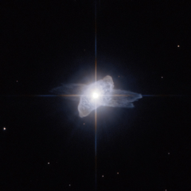

# Preview of potw1012a: "A dying star starts shedding its skin"
[https://www.spacetelescope.org/images/potw1012a/](https://www.spacetelescope.org/images/potw1012a/)

This Hubble Space Telescope picture captures a brief but beautiful phase late in the life of a star. The curious cloud around this bright star is called IRAS 19475+3119. It lies in the constellation of Cygnus (the Swan) about 15 000 light-years from Earth in the plane of our Milky Way galaxy. As stars similar to the Sun age they swell into red giant stars and when this phase ends they start to shed their atmospheres into space. The surroundings become rich in dust and the star is still relatively cool. At this point the cloud shines by reflecting the brilliant light of the central star and the warm dust gives off lots of infrared radiation. It was this infrared radiation that was detected by the IRAS satellite in 1983 and brought the object to the attention of astronomers. Jets from the star may create strange hollow lobes, and in the case of IRAS 19475+3119 two such features appear at different angles. These curious objects are rare and short-lived. As the star continues to shed material the hotter core is gradually revealed. The intense ultraviolet radiation causes the surrounding gas to glow brilliantly and a planetary nebula is born. The objects that come before planetary nebulae, such as IRAS 19475+3119, are known as preplanetary nebulae, or protoplanetary nebulae. They have nothing to do with planets — the name planetary nebula arose as they looked rather like the outer planets Uranus and Neptune when seen through small telescopes. This image was created from images taken using the High Resolution Channel of the Hubble Space Telescope’s Advanced Camera for Surveys. The red light was captured through a filter letting through yellow and red light (F606W) and the blue was recorded through a standard blue filter (F435W). The green layer of the image was created by combining the blue and red images. The total exposure times were 24 s and 245 s for red and blue respectively. The field of view is about twenty arcseconds across.