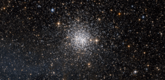

# Preview of potw1013a: "NGC 1872: open or globular cluster?"
[https://www.spacetelescope.org/images/potw1013a/](https://www.spacetelescope.org/images/potw1013a/)

This spectacular NASA/ESA Hubble Space Telescope picture shows NGC 1872, a rich cluster of thousands of stars lying in our small neighbouring galaxy, the Large Magellanic Cloud. This little-studied cluster is located in the constellation of Dorado (the Dolphinfish, a fish unrelated to the dolphin and which often appears on dinner menus under its Hawaiian name mahi-mahi). The Scottish astronomer James Dunlop was probably the first to spot NGC 1872 in 1826 with a small telescope near Sydney in Australia. Clusters are very interesting to astronomers because the stars in them all formed together in both space and time and hence the stars we see now are of similar ages and similar initial composition. Cluster studies have been vital in working out how stars evolve and the power of Hubble allows these studies to be taken beyond our own Milky Way and out into the Local Group of our neighbouring galaxies. Star clusters are usually classed as either open or globular but NGC 1872 has characteristics of both — it is as rich as a typical globular but is much younger, and, like many open clusters, has bluer stars. Such intermediate clusters are common in the Large Magellanic Cloud. This image was acquired using the Wide Field Channel of the Advanced Camera for Surveys on the Hubble Space Telescope. It was created from images taken through yellow (F555W) and near-infrared (F814W) filters, coloured blue and red in the image. The exposure times were 115 s and 90 s respectively and the field of view is about 3.0 by 1.5 arcminutes.