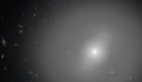

# Preview of potw1014a: "Red, but not dead"
[https://www.spacetelescope.org/images/potw1014a/](https://www.spacetelescope.org/images/potw1014a/)

This NASA/ESA Hubble Space Telescope picture depicts the galaxy NGC 1533 in the southern constellation of Dorado (the Dolphin-fish). Around 62 million light-years from Earth, NGC 1533, which is classed as a lenticular galaxy, is a transitional type that shows characteristics of both spiral and elliptical galaxies. Like elliptical galaxies, NGC 1533 is largely made up of older and redder stars and vast numbers of them create the smooth glow across the whole picture. However, it also has a residual level of star formation and some young blue stars, which are revealed by its weak barred spiral structure that is faintly visible in this image. Astronomers studying star formation in this type of galaxy are able to subtract the bright light of the stars to reveal the details of a subtle spiral structure that cannot be well seen in less heavily processed images such as this one. John Herschel, son of William Herschel, the astronomer who discovered Uranus, found NGC 1533 in 1834 during his survey of the southern skies from the Cape of Good Hope. The image was created from images taken using the Wide Field Channel of Hubble's Advanced Camera for Surveys. It is a composite of images taken through yellow (F606W) and near-infrared (F814W) filters. The total exposure times were 38 minutes and 82 minutes respectively and the field of view is about 2.6 by 1.5 arcminutes across. Links  A paper discussing NGC 1533, including how to reveal its hidden spiral    structure