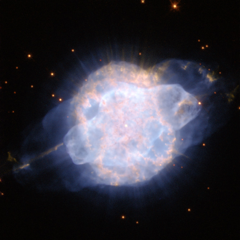

# Preview of potw1015a: "A piercing eye in the sky"
[https://www.spacetelescope.org/images/potw1015a/](https://www.spacetelescope.org/images/potw1015a/)

This dramatic image from the NASA/ESA Hubble Space Telescope shows the planetary nebula NGC 3918, a brilliant cloud of colourful gas in the constellation of Centaurus, around 4900 light-years from Earth. In the centre of the cloud of gas, and completely dwarfed by the nebula, are the dying remnants of a red giant. During the final convulsive phase in the evolution of these stars, huge clouds of gas are ejected from the surface of the star before it emerges from its cocoon as a white dwarf. The intense ultraviolet radiation from the tiny remnant star then causes the surrounding gas to glow like a fluorescent sign. These extraordinary and colourful planetary nebulae are among the most dramatic sights in the night sky, and often have strange and irregular shapes, which are not yet fully explained. NGC 3918’s distinctive eye-like shape, with a bright inner shell of gas and a more diffuse outer shell that extends far from the nebula looks as if it could be the result of two separate ejections of gas. But this is in fact not the case: studies of the object suggest that they were formed at the same time, but are being blown from the star at different speeds. The powerful jets of gas emerging from the ends of the large structure are estimated to be shooting away from the star at speeds of up to 350 000 kilometres per hour. By the standards of astronomical phenomena, planetary nebulae like NGC 3918 are very short-lived, with a lifespan of just a few tens of thousands of years. The image is a composite of visible and near-infrared snapshots taken with Hubble’s Wide Field Planetary Camera 2. The filters used were F658N, F814W, F555W and F502N, seen in red, orange, green and blue respectively. The image is about 20 arcseconds across.