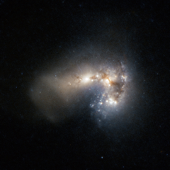

# Preview of potw1016a: "Frenzied star birth in Haro 11"
[https://www.spacetelescope.org/images/potw1016a/](https://www.spacetelescope.org/images/potw1016a/)

Haro 11 appears to shine gently amid clouds of gas and dust, but this placid facade belies the monumental rate of star formation occurring in this “starburst” galaxy. By combining data from the NASA/ESA Hubble Space Telescope and ESO’s Very Large Telescope, astronomers have created a new image of this incredibly bright and distant galaxy. The team of astronomers from Stockholm University, Sweden, and the Geneva Observatory, Switzerland, have identified 200 separate clusters of very young, massive stars. Most of these are less than 10 million years old. Many of the clusters are so bright in infrared light that astronomers suspect that the stars are still emerging from the cloudy cocoons where they were born. The observations have led the astronomers to conclude that Haro 11 is most likely the result of a merger between a galaxy rich in stars and a younger, gas-rich galaxy. Haro 11 is found to produce stars at a frantic rate, converting about 20 solar masses of gas into stars every year. Haro galaxies, first discovered by the noted astronomer Guillermo Haro in 1956, are defined by unusually intense blue and violet light. Usually this high energy radiation comes from the presence of many newborn stars or an active galactic nucleus. Haro 11 is about 300 million light-years away and is the second closest of such starburst galaxies. The paper describing this result (“Super star clusters in Haro 11: Properties of a very young starburst and evidence for a near-infrared flux excess”, by A. Adamo et al.) is available at http://adsabs.harvard.edu/doi/10.1111/j.1365-2966.2010.16983.x