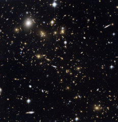

# Preview of potw1017a: "A snowstorm of distant galaxies"
[https://www.spacetelescope.org/images/potw1017a/](https://www.spacetelescope.org/images/potw1017a/)

At first glance, the scatter of pale dots on this NASA/ESA Hubble Space Telescope image looks like a snowstorm in the night sky. But almost every one of these delicate snowflakes is a distant galaxy in the cluster MACS J0717.5+3745 and each is home to billions of stars. This apparently placid scene also hides a storm of epic scale. This picture shows a region where three galaxy clusters are merging and releasing enormous amounts of energy in the form of X-rays. These distant objects are around 5.4 billion light-years from Earth, and were imaged during the Massive Cluster Survey, a project to study distant clusters of galaxies using Hubble. The amount of mass in this sea of galaxies is huge, and is great enough to visibly bend the fabric of spacetime. The strange distortion in the shapes of many of the galaxies in this picture, which appear stretched and bent as if they were looked at through a glass bottle, is a result of gravitational lensing, where the gravitational fields around massive objects bend light around them. Predicted by Einstein in his famous general theory of relativity, gravity’s ability to distort light was first demonstrated in 1919 in a well-known experiment carried out by Sir Arthur Eddington, who led an expedition to the island of Principe, off the coast of Africa, to measure the apparent shift of a star when observed close to the edge of the Sun’s disc during a solar eclipse. This picture was created from images taken through near-infrared (F814W) and yellow (F555W) filters using the Wide Field Channel of Hubble’s Advanced Camera for Surveys. The exposure times were about 67 minutes and 33 minutes respectively and the field of view of the image is about 3 arcminutes across. Links  The MACS survey Further information:     http://www.spacetelescope.org/images/opo0917a/   http://chandra.harvard.edu/photo/2009/macs/   