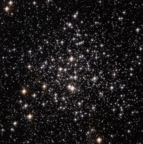

# Preview of potw1018a: "Messier 71: an unusual globular cluster"
[https://www.spacetelescope.org/images/potw1018a/](https://www.spacetelescope.org/images/potw1018a/)

This spectacular NASA/ESA Hubble Space Telescope image shows a bright scattering of stars in the small constellation of Sagitta (the Arrow). This is the centre of the globular cluster Messier 71, a great ball of ancient stars on the edge of our galaxy around 13 000 light-years from Earth. M71 is around 27 light-years across. Globular clusters are like galactic suburbs, pockets of stars that exist on the edge of major galaxies. These clusters are tightly bound together by their gravitational attraction, hence their spherical shape and their name: globulus means “little sphere” in Latin. Around 150 such globular clusters are known to exist around our Milky Way, each one of them containing several hundred thousand stars. Messier 71 has been known for a long time, having been first spotted in the mid eighteenth century by Swiss astronomer Jean-Philippe de Cheseaux. Cheseaux discovered a number of nebulae in his career, and also spent much time studying religion: one posthumously published work attempted to derive the exact date of Christ’s crucifixion from astronomical events noted in the Bible. Despite being a familiar object, Messier 71’s precise nature was disputed until recently. Was it simply an open cluster, a loosely bound group of stars? This was for many years the dominant view. But in the 1970s, astronomers came to the view that it is in fact a relatively sparse globular cluster. The stars in Messier 71, as is usual in such clusters, are relatively old, at around 9 to 10 billion years, and consequently are low in elements other than hydrogen and helium. This picture was created from images taken with the Wide Field Channel of the Advanced Camera for Surveys on Hubble. It is a combination of images taken through yellow (F606W — coloured blue) and near-infrared (F814W — coloured red) filters. The exposure times were 304 s and 324 s respectively. The field of view is about 3.4 arcminutes across.