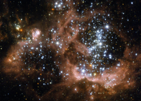

# Preview of potw1019a: "Young stars biting the cloud that feeds them"
[https://www.spacetelescope.org/images/potw1019a/](https://www.spacetelescope.org/images/potw1019a/)

A billowing cloud of hydrogen in the Triangulum galaxy (Messier 33), about 2.7 million light-years away from Earth, glows with the energy released by hundreds of young, bright stars. This NASA/ESA Hubble Spare Telescope image provides the sharpest view of NGC 604 so far obtained. Some 1500 light-years across, this is one of the largest, brightest concentrations of ionised hydrogen (H II) in our local group of galaxies, and is a major centre of star formation. The gas in NGC 604, around nine tenths of it hydrogen, is gradually collapsing under the force of gravity to create new stars. Once these stars have formed, the vigorous ultraviolet radiation they emit excites the remaining gas in the cloud, making it glow a distinct shade of red. This colour is typical not only of NGC 604 but of other H II regions too. Although it is part of Messier 33 this object is so bright and prominent that it was given its own NGC number. The fierce ultraviolet radiation released by the stars that give these hydrogen clouds their distinctive glow is also the cause of their uneven appearance and eventual disappearance. The radiation and winds blowing from the surface of these stars gradually erode the cloud they formed from, causing the gases to slowly disperse. The complex structure of NGC 604, with irregular bubbles and wispy filament-like structures alongside denser, redder areas is due to the same forces that will eventually make the cloud disappear. The blister-like cavities show areas of stronger erosion of the cloud. While these areas appear dark in this photograph, they shine brightly at X-ray wavelengths. This image was created from images taken using the High Resolution Channel of Hubble's Advanced Camera for Surveys. It is a composite of images taken through a total of seven different filters spanning a huge range of wavelengths — from 220 nm in the ultraviolet all the way up to the near infrared at one micron. The field of view is about 31 by 22 arcseconds.