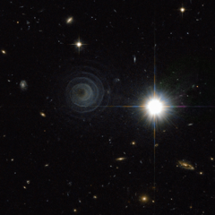

# Preview of potw1020a: "An extraordinary celestial spiral"
[https://www.spacetelescope.org/images/potw1020a/](https://www.spacetelescope.org/images/potw1020a/)

This remarkable picture from the Advanced Camera for Surveys on the NASA/ESA Hubble Space Telescope shows one of the most perfect geometrical forms created in space. It captures the formation of an unusual pre-planetary nebula, known as IRAS 23166+1655, around the star LL Pegasi (also known as AFGL 3068) in the constellation of Pegasus (the Winged Horse). The striking picture shows what appears to be a thin spiral pattern of astonishingly regularity winding around the star, which is itself hidden behind thick dust. The spiral pattern suggests a regular periodic origin for the nebula’s shape. The material forming the spiral is moving outwards a speed of about 50 000 km/hour and, by combining this speed with the distance between layers, astronomers calculate that the shells are each separated by about 800 years.The spiral is thought to arise because LL Pegasi is a binary system, with the star that is losing material and a companion star orbiting each other. The spacing between layers in the spiral is expected to directly reflect the orbital period of the binary, which is indeed estimated to be also about 800 years.The creation and shaping of planetary nebulae is an exciting area of stellar evolution. Stars with masses from about half that of the Sun up to about eight times that of the Sun do not explode as supernovae at the ends of their lives. Instead a more regal end awaits them as their outer layers of gas are shed and drift into space, creating striking and intricate structures that to Earth-bound observers often look like dramatic watercolour paintings. IRAS 23166+1655 is just starting this process and the central star has yet to emerge from the cocoon of enveloping dust.This picture was created from images from the Wide Field Channel of the Advanced Camera for Surveys on Hubble. Images through a yellow filter (F606W, coloured blue) were combined with images through a near-infra red filter (F804W, coloured red). The exposure times were 11 minutes and 22 minutes respectively and the field of view spans about 80 arcseconds.Links  Paper discussing the intriguing AFGL 3068 (PDF format) 