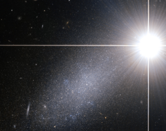

# Preview of potw1021a: "Bright star — faint galaxy"
[https://www.spacetelescope.org/images/potw1021a/](https://www.spacetelescope.org/images/potw1021a/)

Astronomers are used to encountering challenges in their work, but studying the prosaically-named galaxy PGC 39058 proves more difficult than usual. Due to a stroke of bad luck, a bright star happens to lie between the galaxy and the Earth, meaning our view is partly obscured by the glare of the star. The astounding image from the NASA/ESA Hubble Space Telescope shows the nearby star easily outshining the more distant galaxy PGC 39058. The galaxy is about 14 million light-years away and contains millions of stars — many of them not unlike the bright star in the foreground. The bright foreground star seems to shine with incredible intensity due to the power of Hubble. Most Earth-bound observers would however consider the star to be quite faint. At magnitude 6.7, binoculars or a small telescope are needed to see it at all. That the image manages to capture both objects serves to further highlight Hubble’s excellent optics and sharp vision. PGC 39058 is a dwarf galaxy, which explains its faintness despite its modest distance by galaxy standards. The sharp Hubble image easily resolves it completely into its component stars and also reveals many much more distant galaxies in the background. This star and galaxy pair is located within the constellation of Draco (the Dragon). It is visible in the northern hemisphere, appearing to slither over a large portion of the sky around the north celestial pole. The ancient Greeks claimed that Draco represented Ladon, the dragon with 100 heads. One of Hercules' twelve near-impossible tasks was to steal golden apples guarded by Ladon. The difficulty of this challenge is perhaps on a par with observing such a faint galaxy obscured by a bright star. This picture was created from images taken using the Wide Field Channel of Hubble’s Advanced Camera for Surveys. Images through yellow (F606W, shown as blue) and near infrared (F814W, shown as red) were combined. The exposure times were 20 minutes and 15 minutes respectively and the field of view is 2 × 1.6 arcminutes.