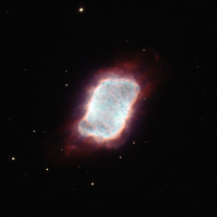

# Preview of potw1022a: "A star Makes a billowy exit"
[https://www.spacetelescope.org/images/potw1022a/](https://www.spacetelescope.org/images/potw1022a/)

The NASA/ESA Hubble Space Telescope snapped this striking image of an aging star whose outer layers of gas have blown off into space. These gases glow in the fierce ultraviolet glare from the hot, small remnant of the star at the cloud's centre. This object, which is designated NGC 6741, also known as the Phantom Streak Nebula, is located about 7000 light-years away in the constellation of Aquila (the Eagle). NGC 6741 is classed as a planetary nebula, though no planets are responsible for this billowy cloud; the term came about in the 18th century because the round gas shells resembled the Solar System's outer giant planets in astronomers' telescopes. Although fairly bright, this object appears very small though a typical telescope and was missed by early surveyors of the skies and only spotted in 1882 by Edward Charles Pickering. Stars with sizes that are somewhat smaller than our Sun to several times its mass often become planetary nebulae. This brief, late-in-life phase is entered after stars have ballooned into red giants. The still-energetic cores of these swollen stars cast off their own outer gaseous layers and the expanding bubble of material is set aglow by the central star's intense ultraviolet light. The newly formed planetary nebula then shines for perhaps 10 000 years before the material drifts away and leaves the progenitor star to very slowly cool and fade. Planetary nebulae are short-lived and come in a wide assortment of shapes and sizes. Only about a fifth are spherical, and others can look like rings, discs, tubes or be entirely without symmetry, owing to distortions introduced by magnetic fields, binary central stars and as-yet unexplained phenomena. NGC 6741 does contain a second star and is thought to be well along in its period as a planetary nebula, and has assumed more of a rectangular shape, rather like a luminous pillow. This picture was created from images taken with Hubble's Wide Field Planetary Camera 2. The red light was captured through a filter that isolated the red glow from hydrogen (F658N), light through a yellow filter was coloured green (F555W), and the blue was a combination of the green and the glow of oxygen (F555W and F502N). The exposure times were ten minutes (F658N), two minutes (F555W) and ten minutes (F502W). The field of view spans just 24 arcseconds.