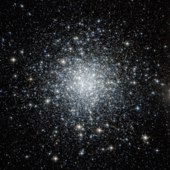

# Preview of potw1023a: "A Distant backwater of the Milky Way "
[https://www.spacetelescope.org/images/potw1023a/](https://www.spacetelescope.org/images/potw1023a/)

This bright spray of stars in the small but evocative constellation of Delphinus (the Dolphin) is the globular cluster NGC 6934. Globular clusters are large balls of (typically) a few hundred thousand ancient stars that exist on the edges of galaxies. Lying 50 000 light-years from Earth, in the outer reaches of our Milky Way galaxy, NGC 6934 is home to some of the most distant stars still to be part of our galactic system — in a sense, it is a far-flung suburb to the Milky Way’s city centre. NGC 6934 was first seen by William Herschel in the late eighteenth century. He classified it as a “bright nebula” and was not able to resolve it into stars. The cluster is not bright enough to see with the naked eye, and even in ideal conditions it is very difficult to view with binoculars. However, it is a popular target for amateur astronomers as it can easily be observed using relatively inexpensive telescopes. Broadcaster Patrick Moore, presenter of BBC TV’s The Sky at Night for more than 50 years, included this cluster in his “Caldwell catalogue” of celestial objects that amateur astronomers should look out for.NGC 6934’s faintness is down to its distance — not how bright it really is. With its many thousands of stars, the cluster is no minnow. The fact that the huge core of our galaxy dwarfs it, along with the other 150 or so globular clusters that orbit the Milky Way’s galactic centre, is a reminder of the breathtaking scale of the cosmos.This picture was taken with the Wide Field Channel of the NASA/ESA Hubble Space Telescope’s Advanced Camera for Surveys. It was created from images taken through filters F814W (near infrared) and F606W (orange), coloured red and blue respectively. The exposure times were 29 minutes per filter, and the field of view is 3.3 arcminutes across.