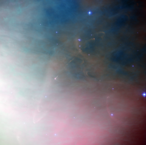

# Preview of potw1024a: "Star formation fireworks in Orion"
[https://www.spacetelescope.org/images/potw1024a/](https://www.spacetelescope.org/images/potw1024a/)

The keen eye of the NASA/ESA Hubble Space Telescope has often peered deeply into the Orion Nebula to see the processes occurring there and revealed many dramatic tableaux of young stars hurling material into space and entire solar systems forming. This image shows the spectacular region around an object known as Herbig-Haro 502, a very small part of the vast stellar nursery. The entire picture is filled with the rich colourful glow of the nebula and, just left of the centre, a star embedded in a pinkish glow can be also seen. This fascinating object is an example of a very young star surrounded by the cloud of gas from which it formed. This leftover material may accrete to form planets and eventually solar systems as intricate as our own. It is highly likely that the material that now forms our own planet Earth was part of a similar gaseous cocoon about five billion years ago. Such is the importance of these objects that much Hubble observing time has been dedicated to studying them. In this image Herbig-Haro 502 shows up as a narrow pink jet extending away from the young star as well as curved bow shock features to the upper-right and lower-left. Herbig-Haro objects are striking areas of nebulosity near to recently formed stars. They are created when the very young stars eject gas at breakneck speeds of hundreds of kilometres per second, which impacts the surrounding gas and dust. These ephemeral shockwaves are thought to dissipate after a few thousand years; the blink of an eye in astronomical terms. They vary in size but are often much larger than our own Solar System. At only around 1500 light-years distant, the Orion Nebula it is one of the closest areas of star formation to us. Understanding how stars form and evolve is an important area of astronomy, and one to which Hubble has greatly contributed. Images such as this are not only beautiful from an artistic perspective, but also help us understand more about how the Universe developed, and is continuing to change. This image was taken with the Wide Field Channel of the Advanced Camera for Surveys on Hubble. This picture was created from images taken through filters that isolate the light from glowing hydrogen (F658N, coloured red), ionised oxygen (F502N, coloured green) and yellow light (F550W, coloured blue). The exposures times were 1000 s, 2000 s and 1000 s respectively. The field of view is about 3.3 arcminutes across.