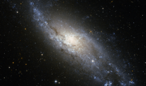

# Preview of potw1025a: "A cosmic whirlpool in Tucana"
[https://www.spacetelescope.org/images/potw1025a/](https://www.spacetelescope.org/images/potw1025a/)

The beautiful spiral galaxy NGC 406 was discovered in 1834 by John Herschel and is here imaged in great detail by the NASA/ESA Hubble Space Telescope. Located some 65 million light-years away, in the southern constellation of Tucana (the Toucan), NGC 406 is about 60 000 light-years across, roughly half the diameter of our galaxy, the Milky Way. It is a spiral galaxy quite similar to the well known Whirlpool galaxy (Messier 51, see http://www.spacetelescope.org/images/opo0110a/). In a moderate-sized amateur telescope NGC 406 would appear as a faint hazy blob, like thousands of others across the sky, and none of the spectacular fine detail in the Hubble picture could be made out. In this image the galaxy exhibits spiral arms that are mainly populated by young, massive, bluish stars and crossed by dark dust lanes. As is typically observed in this kind of spiral galaxy, the yellowish central bulge, dominated by an older stellar population, is less prominent and almost totally embedded in the disk structure. The deep image also shows a significant number of more distant galaxies in the background. Some of them are visible as reddish fuzzy spots through the bluish spiral arms of the foreground galaxy. This picture was created from images taken through near-infrared (F814W) and blue (F435W) filters, shown in red and blue respectively, using the Wide Field Channel of Hubble’s Advanced Camera for Surveys. The exposure times were twenty minutes per filter and the field of view is 2.7 by 1.6 arcminutes.