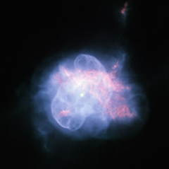

# Preview of potw1026a: "An odd planetary nebula in Hercules"
[https://www.spacetelescope.org/images/potw1026a/](https://www.spacetelescope.org/images/potw1026a/)

The NASA/ESA Hubble Space Telescope has taken a striking high resolution image of the curious planetary nebula NGC 6210. Located about 6500 light-years away, in the constellation of Hercules, NGC 6210 was discovered in 1825 by the German astronomer Friedrich Georg Wilhelm Struve. Although in a small telescope it appears only as a tiny disc, it is fairly bright. NGC 6210 is the last gasp of a star slightly less massive than our Sun at the final stage of its life cycle. The multiple shells of material ejected by the dying star form a superposition of structures with different degrees of symmetry, giving NGC 6210 its odd shape. This sharp image shows the inner region of this planetary nebula in unprecedented detail, where the central star is surrounded by a thin, bluish bubble that reveals a delicate filamentary structure. This bubble is superposed onto an asymmetric, reddish gas formation where holes, filaments and pillars are clearly visible. The life of a star ends when the fuel available to its thermonuclear engine runs out. The estimated lifetime for a Sun-like star is some ten billion years. When the star is about to expire, it becomes unstable and ejects its outer layers, forming a planetary nebula and leaving behind a tiny, but very hot, remnant, known as white dwarf. This compact object, here visible at the centre of the image, cools down and fades very slowly. Stellar evolution theory predicts that our Sun will experience the same fate as NGC 6210 in about five billion years. This picture was created from images taken with Hubble’s Wide Field Planetary Camera 2 through three filters: the broadband filter F555W (yellow) and the narrowband filters F656N (ionised hydrogen), F658N (ionised nitrogen) and F502N (ionised oxygen). The exposure times were 80 s, 140 s, 800 s and 700 s respectively and the field of view is only about 28 arcseconds across.