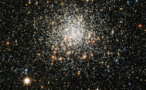

# Preview of potw1027a: "A great ball of stars"
[https://www.spacetelescope.org/images/potw1027a/](https://www.spacetelescope.org/images/potw1027a/)

The NASA/ESA Hubble Space Telescope has turned its sharp eye towards a tight collection of stars, first seen 174 years ago. The result is a sparkling image of NGC 1806, tens of thousands of stars gravitationally bound into a rich cluster. Commonly called globular clusters, most of these objects are very old, having formed in the distant past when the Universe was only a fraction of its current age. NGC 1806 lies within the Large Magellanic Cloud, a satellite galaxy of our own Milky Way. It can be observed within the constellation of Dorado (the dolphin-fish), an area of the sky best seen from the Earth’s southern hemisphere. NGC 1806 was discovered in 1836 by the British astronomer John Herschel. He had travelled to South Africa in order to catalogue astronomical objects visible best from southern latitudes, and thereby complete work begun by his father William, the man who coined the term “globular cluster”. Using a large telescope John Herschel carefully scanned the night sky and noted objects of interest, of which NGC 1806 was one. In the same year that he documented NGC 1806 he was visited by the naturalist Charles Darwin after the HMS Beagle stopped over in Cape Town. Darwin later referred to John Herschel as “one of our greatest philosophers”.  The Wide Field Channel of Hubble's Advanced Camera for Surveys was used to obtain this picture that was created from images taken through blue (F435W, coloured blue), yellow (F555W, coloured green) and near-infrared (F814W, coloured red) filters. The exposure times were 770 s, 720 s and 688 s, respectively, and the field of view is  3.1 by 1.9 arcminutes. Surely Herschel, who made great contributions to the sciences of both astronomy and photography, would have been immensely impressed by this glittering Hubble picture