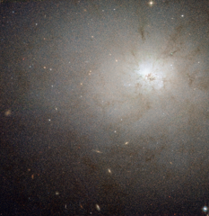

# Preview of potw1028a: "A deceptively quiet galaxy"
[https://www.spacetelescope.org/images/potw1028a/](https://www.spacetelescope.org/images/potw1028a/)

At first glance NGC 3077 looks like a typical, relatively peaceful elliptical galaxy. However, as this NASA/ESA Hubble Space Telescope image dramatically reveals it is actually a hotbed of very energetic star formation and the whole galaxy is laced with dusty tendrils. It lies about 13 million light-years from Earth.NGC 3077 was first seen by William Herschel with his 47 cm telescope in England in 1801, when he was close to completing his sky surveys. It is located in the far northern sky in the constellation of Ursa Major (the Great Bear) and forms a triplet with two brighter nearby galaxies, the graceful spiral Messier 81 and the very peculiar and active starburst galaxy Messier 82.Although overshadowed by its brighter neighbours, NGC 3077 is also very active and resembles a less dramatic version of Messier 82. Interactions between the three galaxies have stoked the fires of star formation in the core of the galaxy and the brilliant glow of many huge young star clusters at the centre of NGC 3077 dominates the Hubble image. If you look closely you can see vast numbers of individual stars in the galaxy across the entire image, as well as several, much more remote, galaxies seen through the much closer NGC 3077.This picture was created from images taken using the Wide Field Channel on Hubble’s Advanced Camera for Surveys. It was made from images through blue (F475W, coloured blue), orange (F606W, coloured green) and near-infrared (F814W, coloured red) filters. The exposure times were about 27 minutes per filter. The field of view extends over about 3.3 arcminutes.