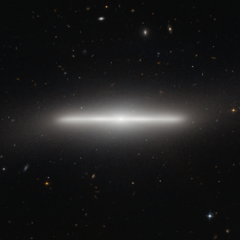

# Preview of potw1029a: "An extraordinarily slender galaxy"
[https://www.spacetelescope.org/images/potw1029a/](https://www.spacetelescope.org/images/potw1029a/)

The NASA/ESA Hubble Space Telescope has imaged a striking galaxy called NGC 4452, which appears to lie exactly edge-on as seen from Earth. The result is an extraordinary picture of billions of stars observed from an unusual angle. The bright nucleus can be seen at the centre, along with the very thin disc that looks like a straight line from our unusual viewing position. To complete the picture, a hazy halo of stars on the periphery of the galaxy makes it seem to glow.NGC 4452 was first seen by William Herschel in 1784 with his 47 cm telescope in England. He described the object as a bright nebula, small and very much elongated. The new Hubble image shows just how elongated this unusual object really is.Galaxies are like star cities, and typically contain many billions of stars. The American astronomer Edwin Hubble, after whom the Hubble Space Telescope is named, was the first person to prove that there are other galaxies beyond our own by measuring their distances. This work, done in the 1920s, forever changed our view of the Universe.Galaxies also belong to collections that are called galaxy clusters. NGC 4452 is part of the Virgo Cluster, so-called because many of its members appear in the constellation of Virgo (the Maiden). This enormous grouping is approximately 60 million light-years distant and contains around 2000 galaxies. It is thought that the Local Group of galaxies, to which our own Milky Way belongs, is on the fringes of the Virgo Cluster, and at some point in the far future the Local Group may be pulled slowly into the Virgo Cluster by the force of gravity. Large numbers of much more remote, faint galaxies, far beyond NGC 4452 and the Virgo Cluster, appear in the background of this image.This picture of NGC 4452 was created from images taken using the Wide Field Channel on Hubble’s Advanced Camera for Surveys. This picture was made from images through blue (F475W, coloured blue) and near-infrared (F850LP, coloured red) filters. The exposures times were 750 s and 1210 s respectively. The field of view extends over 2.6 arcminutes.