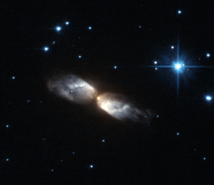

# Preview of potw1030a: "Hubble witnesses the crafting of a celestial masterpiece"
[https://www.spacetelescope.org/images/potw1030a/](https://www.spacetelescope.org/images/potw1030a/)

The NASA/ESA Hubble Space Telescope has used its Advanced Camera for Surveys to peer closely at the strange cloud of gas and dust that envelops a star at a late stage in its life, a short-lived phenomenon known as a protoplanetary, or pre-planetary nebula. These fascinating celestial objects give astronomers an opportunity to watch the early stages of planetary nebula formation, as the gas and dust is moulded by high velocity winds — like watching a glassblower at work in his factory. Despite their rather confusing names, these objects are unrelated to planets. The name arose because of the superficial visual similarity between planetary nebulae and the small discs of the outer planets in the Solar System when viewed through a telescope.The protoplanetary nebula shown in this image is known as IRAS 20068+4051 and it is found in the constellation of Cygnus. The shell formed when its progenitor star exhausted its hydrogen fuel for nuclear fusion, causing the outer layers of the star to expand and cool, which created a spherical envelope of gas and dust around the star. The mechanism that drives high velocity winds to then shape this spherical envelope into the intricate structure that we see here is still unclear, which is why continued observation of protoplanetary nebulae is so important. Meanwhile, as the central star continues to evolve, finding new ways to prevent itself from collapsing under its own gravity, it will eventually become hot enough to make the gas glow as a spectacular planetary nebula. These objects emit a broad spectrum of radiation, including visible light, making them great targets for both amateur and professional astronomers.However, protoplanetary nebulae, which often appear smaller and are seen best in infrared light, are much trickier to observe, particularly since water vapour in the Earth’s atmosphere absorbs most infrared wavelengths. But Hubble has exceptionally sharp vision and an unobstructed vantage point in space, making it possible to capture stunning images of these peculiar objects.This picture was created from images taken through yellow (F606W, coloured blue) and near-infrared (F814W, coloured red) filters using the High Resolution Channel of Hubble’s Advanced Camera for Surveys. The exposure times were 1280 s (F606W) and 200 s (F814W) and the field of view spans about 25 arcseconds.