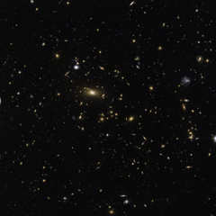

# Preview of potw1031a: "Galactic moths drawn to a bright light "
[https://www.spacetelescope.org/images/potw1031a/](https://www.spacetelescope.org/images/potw1031a/)

Smaller, dimmer galaxies appear to flit like moths around a radiant street light in this image captured by the NASA/ESA Hubble Space Telescope. The brilliant central object is a supergiant elliptical galaxy, the dominant member of a galaxy cluster with the mouthful of a name MACSJ1423.8+2404. This great swarm of galaxies is located about five billion light-years away in the constellation Boötes (the Herdsman). MACSJ1423.8+2404 and other distant galaxy clusters offer astronomers a peek into the earlier days of our Universe when these colossal groupings were still taking shape. Over the 13.7 billion-year history of the cosmos, such galaxy clusters have emerged as the largest observed gravitationally bound structures. But there is much more than meets the eye when it comes to galaxy clusters — they also hint at the vast majority of the Universe’s substance that we have not yet directly detected. Astronomers study clusters such as MACSJ1423.8+2404 to better understand the influence of dark energy, a mysterious force credited with accelerating the expansion of the Universe and accounting for some 72 percent of the mass of the Universe.The application of what we can see and detect to the study of what we cannot does not end there with MACSJ1423.8+2404 and its ilk. Dark matter, estimated to account for about 23 percent of the mass of the Universe, exists in great quantities in galaxy clusters. The “normal” matter that comprises stars, planets and us trickles in at less than 5 percent.Astronomers observe clusters to study how this dark matter gravitationally gathers visible matter and underpins these vast cosmic metropolises. The galactic moths are drawn to the clusters not by their light, but by the vast unseen reservoir of dark matter. This image was created from images taken using the Wide Field Channel of Hubble’s Advanced Camera for Surveys. The exposures were 75 and 76 minutes respectively, through yellow (F555W) and near-infrared (F814W) filters. The field of view is 3.2 arcminutes across.