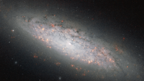

# Preview of potw1032a: "At the edge of the abyss"
[https://www.spacetelescope.org/images/potw1032a/](https://www.spacetelescope.org/images/potw1032a/)

Fresh starbirth infuses the galaxy NGC 6503 with a vital pink glow in this image from the NASA/ESA Hubble Space Telescope. This galaxy, a smaller version of the Milky Way, is perched near a great void in space where few other galaxies reside. This new image from Hubble’s Advanced Camera for Surveys displays, with particular clarity, the pink-coloured puffs marking where stars have recently formed in NGC 6503's swirling spiral arms. Although structurally similar to the Milky Way, the disc of NGC 6503 spans just 30 000 light-years, or just about a third of the size of the Milky Way, leading astronomers to classify NGC 6503 as a dwarf spiral galaxy. NGC 6503 lies approximately 17 million light-years away in the constellation of Draco (the Dragon). The German astronomer Arthur Auwers discovered this galaxy in July 1854 in a region of space where few other luminous bodies have been found. NGC 6503 sits at the edge of a giant, hollowed-out region of space called the Local Void. The Hercules and Coma galaxy clusters, as well as our own Local Group of galaxies, circumscribe this vast, sparsely populated region. Estimates for the void’s diameter vary from 30 million to more than 150 million light-years — so NGC 6503 does not have a lot of galactic company in its immediate vicinity. The isolation of NGC 6503 inspired the stargazer Stephen James O'Meara to name it the Lost-In-Space Galaxy in his book Hidden Treasures. This Hubble image was created from exposures taken with the Wide Field Channel of the Advanced Camera for Surveys. The filters were unusual, which explains the peculiar colour balance of this picture. The red colouration derives from a 28-minute exposure through a filter that just allows the emission from hydrogen gas (F658N) to pass and which reveals the glowing clouds of gas associated with star-forming regions. This was combined with a 12-minute exposure through a near-infrared filter (F814W), which was coloured blue for contrast. The field of view is 3.3 by 1.8 arcminutes.