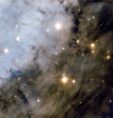

# Preview of potw1033a: "Hubble peers deeply into the Eagle Nebula"
[https://www.spacetelescope.org/images/potw1033a/](https://www.spacetelescope.org/images/potw1033a/)

The star cluster is very bright and was discovered in the mid-eighteenth century. The nebula, however, is much more elusive and it took almost a further two decades for it to be first noted by Charles Messier in 1764. Although it is commonly known as the Eagle Nebula, its official designation is Messier 16 and the cluster is also named NGC 6611. One spectacular area of the nebula (outside the field of view) has been nicknamed “The Pillars of Creation” ever since the Hubble Space Telescope captured an iconic image of dramatic pillars of star-forming gas and dust. The cluster and nebula are fascinating targets for small and medium-sized telescopes, particularly from a dark site free from light pollution. Messier 16 can be found within the constellation of Serpens Cauda (the Tail of the Serpent), which is sandwiched between Aquila, Sagittarius, and Ophiuchus in the heart of one of the brightest parts of the Milky Way. Small telescopes with low power are useful for observing large, but faint, swathes of the nebula, whereas 30 cm telescopes and larger may reveal the dark pillars under good conditions. But a space telescope in orbit around the Earth, like Hubble — which boasts a 2.4-metre diameter mirror and state-of-the-art instruments — is required for an image as spectacular as this one. This picture was created from images taken with the Wide Field Channel of Hubble’s Advanced Camera for Surveys. Images through a near-infrared filter (F775W) are coloured red and images through a blue filter (F475W) are blue. The exposures times were one hour and 54 minutes respectively and the field of view is about 3.3 arcminutes across.