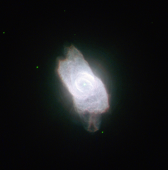

# Preview of potw1034a: "A dazzling planetary nebula"
[https://www.spacetelescope.org/images/potw1034a/](https://www.spacetelescope.org/images/potw1034a/)

The NASA/ESA Hubble Space Telescope has turned its eagle eye to the planetary nebula NGC 6572, a very bright example of these strange but beautiful objects. Planetary nebulae are created during the late stages of the evolution of certain stars that eject gas into space and emit intense ultraviolet radiation that makes the material glow. This picture of NGC 6572 shows the intricate shapes that can develop as stars exhale their last breaths. Hubble has even imaged the central white dwarf star, the origin of the dazzling nebula, but now a faint, but hot, vestige of its former glory. NGC 6572 only began to shed its gases a few thousand years ago, so it is a fairly young planetary nebula. As a result the material is still quite concentrated, which explains why it is abnormally bright. The envelope of gas is currently racing out into space at a speed of around 15 kilometres every second and as it becomes more diffuse, it will dim. NGC 6572 was discovered in 1825 by the German astronomer Friedrich Georg Wilhelm von Struve, who came from a family of distinguished stargazers. The name planetary nebula is left over from the time when the telescopes of early astronomers were not good enough to reveal the true nature of these objects. To many, the discs looked like the outer planets Uranus and Neptune. The application of spectral analysis, later in the 19th century, first revealed that they were glowing gas clouds. NGC 6572 is magnitude 8.1, easily bright enough to make it an appealing target for amateur astronomers with telescopes. It is located within the large constellation of Ophiuchus (the Serpent Bearer) and at low magnification it will appear to be just a coloured star, but higher magnification will reveal its shape. Some observers report that NGC 6572 looks blue, while others state that it is green. Colour as seen through the eyepiece is often a matter of interpretation, so you may make your own decision! This picture was created from images taken with Hubble’s Wide Field Camera 2. Images through a blue filter that isolates the glow from hydrogen gas (Hβ, F487N, coloured dark blue), a green filter that isolates emission from ionised oxygen (F502N, coloured blue), a yellow broadband filter (F555W, coloured green) and a red filter that passes emission from hydrogen (Hα, F656N) have been combined. The exposure times were 360 s, 240 s, 100 s and 180 s, respectively and the field of view is just 29 arcseconds across.