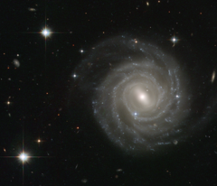

# Preview of potw1035a: "Barred spiral bares all"
[https://www.spacetelescope.org/images/potw1035a/](https://www.spacetelescope.org/images/potw1035a/)

The galaxy captured in this image, called UGC 12158, certainly isn’t camera-shy: this spiral stunner is posing face-on to the NASA/ESA Hubble Space Telescope’s Advanced Camera for Surveys, revealing its structure in fine detail. UGC 12158 is an excellent example of a barred spiral galaxy in the Hubble sequence — a scheme used to categorise galaxies based on their shapes. Barred spirals, as the name suggest, feature spectacular swirling arms of stars that emanate from a bar-shaped centre. Such bar structures are common, being found in about two thirds of spiral galaxies, and are thought to act as funnels, guiding gas to their galactic centres where it accumulates to form newborn stars. These aren’t permanent structures: astronomers think that they slowly disperse over time, so that the galaxies eventually evolve into regular spirals. The appearance of a galaxy changes little over millions of years, but this image also contains a short-lived and brilliant interloper — the bright blue star just to the lower left of the centre of the galaxy is very different from the several foreground stars seen in the image. It is in fact a supernova inside UGC 12158 and much further away than the Milky Way stars in the field — at a distance of about 400 million light-years! This stellar explosion, called SN 2004ef, was first spotted by two British amateur astronomers in September 2004 and the Hubble data shown here form part of the follow-up observations. This picture was created from images taken with the Wide Field Channel of Hubble’s Advanced Camera for Surveys. Images through blue (F475W, coloured blue), yellow (F606W, coloured green) and red (F814W, coloured red) as well as a filter that isolates the light from glowing hydrogen (F658W, also coloured red) have been included. The exposure times were 1160 s, 700 s, 700 s and 1200 s respectively. The field of view is about 2.3 arcminutes across.