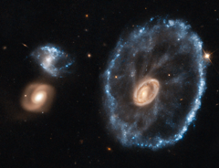

# Preview of potw1036a: "Doing cartwheels to celebrate the end of an era"
[https://esahubble.org/images/potw1036a/](https://esahubble.org/images/potw1036a/)

An image of the Cartwheel Galaxy taken with the NASA/ESA Hubble Space Telescope has been reprocessed using the latest techniques to mark the closure of the Space Telescope European Coordination Facility (ST-ECF), based near Munich in Germany, and to celebrate its achievements in supporting Hubble science in Europe over the past 26 years. Astronomer Bob Fosbury, who is stepping down as Head of the ST-ECF, was responsible for much of the early research into the Cartwheel Galaxy along with the late Tim Hawarden — including giving the object its very apposite name — and so this image was selected as a fitting tribute. The object was first spotted on wide-field images from the UK Schmidt telescope and then studied in detail using the Anglo-Australian Telescope.Lying about 500 million light-years away in the constellation of Sculptor, the cartwheel shape of this galaxy is the result of a violent galactic collision. A smaller galaxy has passed right through a large disc galaxy and produced shock waves that swept up gas and dust — much like the ripples produced when a stone is dropped into a lake — and sparked regions of intense star formation (appearing blue). The outermost ring of the galaxy, which is 1.5 times the size of our Milky Way, marks the shock wave’s leading edge. This object is one of the most dramatic examples of the small class of ring galaxies.This image was produced after Hubble data was reprocessed using the free open source software FITS Liberator 3, which was developed at the ST-ECF. Careful use of this widely used state-of-the-art tool on the original Hubble observations of the Cartwheel Galaxy has brought out more detail in the image than ever before. Although the ST-ECF is closing, ESA’s mission to bring amazing Hubble discoveries to the public will be unaffected, with Hubblecasts, press and photo releases, and Hubble Pictures of the Week continuing to be regularly posted on spacetelescope.org. Links  Space Telescope European Coordination Facility ESA/ESO/NASA FITS Liberator 3 