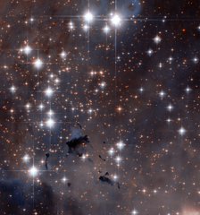

# Preview of potw1101a: "Stellar powerhouses in the Eagle Nebula"
[https://www.spacetelescope.org/images/potw1101a/](https://www.spacetelescope.org/images/potw1101a/)

A spectacular section of the well-known Eagle Nebula has been targeted by the NASA/ESA Hubble Space Telescope. This collection of dazzling stars is called NGC 6611, an open star cluster that formed about 5.5 million years ago and is found approximately 6500 light-years from the Earth. It is a very young cluster, containing many hot, blue stars, whose fierce ultraviolet glow make the surrounding Eagle Nebula glow brightly. The cluster and the associated nebula together are also known as Messier 16.Astronomers refer to areas like the Eagle Nebula as HII regions. This is the scientific notation for ionised hydrogen from which the region is largely made. Extrapolating far into the future, this HII region will eventually disperse, helped along by shockwaves from supernova explosions as the more massive young stars end their brief but brilliant lives. In this image, dark patches can also be spotted, punctuating the stellar landscape. These areas of apparent nothingness are actually very dense regions of gas and dust, which obstruct light from passing through. Many of these may be hiding the sites of the early stages of star formation, before the fledgling stars clear away their surroundings and burst into view. Dark nebulae, large and small, are dotted throughout the Universe. If you look up to the Milky Way with the naked eye from a dark, remote site, you can easily spot some huge dark nebulae blocking the background starlight.This picture was created from images from Hubble’s Wide Field Channel of the Advanced Camera for Surveys through the unusual combination of two near-infrared filters (F775W, coloured blue, and F850LP, coloured red). The image has also been subtly colourised using a ground-based image taken through more conventional filters. The Hubble exposure times were 2000 s in both cases and the field of view is about 3.2 arcminutes across.