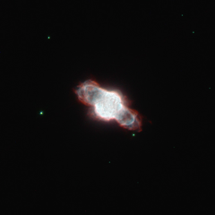

# Preview of potw1102a: "Dying star cocooned within its own gases"
[https://www.spacetelescope.org/images/potw1102a/](https://www.spacetelescope.org/images/potw1102a/)

Astronomers have used the NASA/ESA Hubble Space Telescope to image the tiny planetary nebula NGC 6886. These celestial objects signal the final death throes of mid-sized stars (up to about eight times the mass of the Sun); when such a star exhausts its supply of hydrogen fuel, the outer layers begin to expand and cool, which creates an envelope of gas and dust that shrouds the dying star. However, the star doesn't go down without a fight, finding alternative ways to prevent it from collapsing under its own gravity and emerging as a white dwarf. In the process, the star's surface temperature increases and it is eventually hot enough to emit strong ultraviolet radiation and make the cocoon of gas glow as a stunning planetary nebula. Stellar death isn't quick and painless: the planetary nebula stage typically lasts several tens of thousands of years. By studying the elements that are present in the nebula today, astronomers can determine the original chemical make-up of the star. Studies suggest that the star belonging to NGC 6886 may have originally been similar to the Sun, containing similar quantities of carbon, nitrogen and neon, although heavier elements, such as sulphur, were less plentiful. Keen amateur astronomers with mid-level telescopes will find it a rewarding challenge to track down NGC 6886 in the small constellation of Sagitta. It is tiny, but not particularly faint: high magnification, a good chart, a dark site and averted vision are needed to spot this elusive celestial jewel. This picture was created by combining images taken using the Wide Field Planetary Camera 2 on Hubble. Filters that let through emission from ionised nitrogen gas (F658N, coloured red), ionised oxygen (F502N, coloured blue) and a broadband yellow filter (F555W, coloured green, and also contributing to the blue) were used. The exposure times were 700 s, 600 s and 320 s respectively. The field of view is merely 30 arcseconds across.