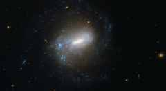

# Preview of potw1103a: "Islands of stars in the river"
[https://www.spacetelescope.org/images/potw1103a/](https://www.spacetelescope.org/images/potw1103a/)

The spiral galaxy NGC 1345 and its loose and ragged arms dominate this rich image from the NASA/ESA Hubble Space Telescope. It is a member of the Eridanus Galaxy Cluster — a group of about 70 galaxies that lies 85 million light-years away in the constellation of Eridanus (the River). This region of the night sky is well populated with bright galaxies, with the Fornax Cluster of galaxies also nearby on the celestial sphere, although the two clusters are actually separated by about 20 million light-years. Collectively, they are known as the Fornax Supercluster or the Southern Supercluster. John Herschel discovered NGC 1345 in 1835 from South Africa. He described it as small and very faint and it is still far from easy to see it even with quite a large amateur telescope, where it appears as a small, circular fuzz. Apart from the main galaxy that dominates the picture, lots more distant galaxies of many shapes and sizes can be seen in this image, some shining right through the foreground galaxy. NGC 1345 itself features an elongated bar extending from the nucleus and spiral arms that emanate outwards, making it a barred spiral type. Classifying galaxy shapes is an important part of astronomical research as it tells us much about how the Universe has evolved. But computers aren’t really ideal for the task; people are much better at recognising shapes, which is why a citizen-science project called Galaxy Zoo: Hubble is asking members of the public to help sift through the vast archive of images and classify galaxies by type. If you would like to join the cause, there’s a link to the project below. This picture was created from images taken with the Wide Field Channel of Hubble’s Advanced Camera for Surveys. Images taken through a blue filter (F435W) were coloured blue and images through a near-infrared filter (F814W) were coloured red. The exposure times were 17.5 minutes per filter in total and the field of view is 3.2 by 1.6 arcminutes. Links   http://www.galaxyzoo.org/ 