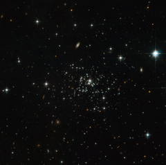

# Preview of potw1104a: "The secret of stellar youth"
[https://www.spacetelescope.org/images/potw1104a/](https://www.spacetelescope.org/images/potw1104a/)

The NASA/ESA Hubble Space Telescope has captured a clear view of the unusual globular cluster Palomar 1, whose youthful beauty is a puzzle for astronomers. This faint and sparse object is very different from the more familiar brilliant and very rich globular clusters and had to wait until 1954 for its discovery by George Abell on photographs from the Palomar Schmidt telescope. Globular clusters are tightly bound conglomerations of stars, which are found in the outer reaches of the Milky Way, in its so-called halo. They are amongst the oldest objects in a galaxy, containing very old stars and no gas, which means there is no possibility of newborn stars introducing some fresh blood into the cluster. However, at 6.3 to 8 billion years old, Palomar 1 is a youngster in globular cluster terms — little more than half the age of most the other globulars in our Milky Way, which formed during our galaxy’s violent early history. However, astronomers suspect that globular youngsters, such as Palomar 1, formed in a more sedate manner. Possibly a gas cloud meandered around in the Milky Way’s halo until a trigger kick-started star formation. Another possibility is that the Milky Way captured the stellar group; perhaps it was adrift in the Universe before it was gravitationally attracted to our galaxy, or maybe it had a violent beginning after all and is the remnant of a dwarf galaxy that was devoured by the Milky Way. Behind the sparsely populated Palomar 1 several background galaxies are seen and a few nearby bright foreground Milky Way stars are also visible. Together with Palomar 1 these objects make up an attractive “family portrait”. This picture was created from images taken with the Wide Field Channel of the Advanced Camera for Surveys. Images through orange (F606W, coloured blue) and near-infrared (F814W, coloured red) filters were combined. The exposure times were 1965 s per filter and the field of view is 3.0 arcminutes across.