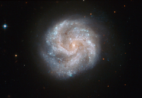

# Preview of potw1105a: "The star city that never sleeps"
[https://www.spacetelescope.org/images/potw1105a/](https://www.spacetelescope.org/images/potw1105a/)

Hubble's Advanced Camera for Surveys has captured this moment in the ever-changing life of a spiral galaxy called IC 391. Although these massive star cities appear static and unchanging, their stellar inhabitants are constantly moving and evolving, with new stars being born and old stars reaching the ends of their lives —often in spectacular fashion, with an immense supernova explosion that can be viewed from Earth. On 3 January 2001, members of the Beijing Astronomical Observatory discovered such an explosion within IC 391 and it was named SN 2001B. This was a Type Ib supernova, which occurs when a massive star runs out of fuel for nuclear fusion and collapses, emitting vast amounts of radiation and creating a powerful shock wave. Hubble has contributed much to our understanding of supernovae in recent years, and it has made an extensive study of supernova 1987A (heic0704), the brightest such stellar explosion to be seen from Earth in over 400 years. IC 391 lies about 80 million light-years away in the constellation of Camelopardalis (the Giraffe) in the far northern part of the sky. The British amateur observer William Denning discovered it in the late nineteenth century, and described it as faint, small and round. This picture was assembled from images taken with Hubble’s Wide Field Channel on the Advanced Camera for Surveys. Images through a blue filter (F435W) were coloured blue, those through a green filter (F555W) are shown as green and those through a near-infrared filter (F814W) are shown in red. The exposure times were 800 s, 700 s and 700 s respectively and the field of view is 2.1 by 1.4 arcminutes.