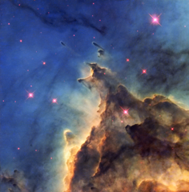

# Preview of potw1106a: "Fiery young stars wreak havoc in stellar nursery"
[https://www.spacetelescope.org/images/potw1106a/](https://www.spacetelescope.org/images/potw1106a/)

The NASA/ESA Hubble Space Telescope has imaged a violent stellar nursery called NGC 2174, in which stars are born in a first-come-first-served feeding frenzy for survival. The problem is that star formation is a very inefficient process; most of the ingredients to make stars are wasted as the cloud of gas and dust, or nebula, gradually disperses. In NGC 2174, the rate at which the nebula disperses is further speeded up by the presence of hot young stars, which create high velocity winds that blow the gas outwards. These fiery youngsters also bombard the surrounding gas with intense radiation, making it glow brightly, creating the brilliant scene captured here. The nebula is mostly composed of hydrogen gas, which is ionised by the ultraviolet radiation emitted by the hot stars, leading to the nebula’s alternative title as an HII region. This picture shows only part of the nebula, where dark dust clouds are strikingly silhouetted against the glowing gas. NGC 2174 lies about 6400 light-years away in the constellation of Orion (The Hunter). It is not part of the much more familiar Orion Nebula, which lies much closer to us. Despite its prime position in a very familiar constellation this nebula is faint and had to wait until 1877 for its discovery by the French astronomer Jean Marie Edouard Stephan using an 80 cm reflecting telescope at the Observatoire de Marseille. This picture was created from images from the Wide Field Planetary Camera 2 on Hubble. Images through four different filters were combined to make the view shown here. Images through a filter isolating the glow from ionised oxygen (F502N) were coloured blue and images through a filter showing glowing hydrogen (F656N) are green. Glowing ionised sulphur (F673N) and the view through a near-infrared filter (F814W) are both coloured red. The total exposure times per filter were 2600 s, 2600 s, 2600 s and 1000 s  respectively and the field of view is about 1.8 arcminutes across.