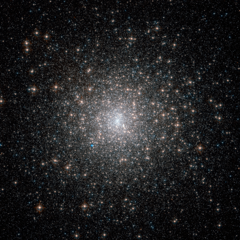

# Preview of potw1107a: "Old stars with a youthful glow"
[https://www.spacetelescope.org/images/potw1107a/](https://www.spacetelescope.org/images/potw1107a/)

The dazzling stars in Messier 15 look fresh and new in this image from the NASA/Hubble Space Telescope, but they are actually all roughly 13 billion years old, making them some of the most ancient objects in the Universe. Unlike another recent Hubble Picture of the Week, which featured the unusually sparse cluster Palomar 1, Messier 15 is rich and bright despite its age. Messier 15 is a globular cluster — a spherical conglomeration of old stars that formed together from the same cloud of gas, found in the outer reaches of the Milky Way in a region known as the halo and orbiting the Galactic Centre. This globular lies about 35 000 light-years from the Earth, in the constellation of Pegasus (The Flying Horse). Messier 15 is one of the densest globulars known, with the vast majority of the cluster’s mass concentrated in the core. Astronomers think that particularly dense globulars, like this one, underwent a process called core collapse, in which gravitational interactions between stars led to many members of the cluster migrating towards the centre. Messier 15 is also the first globular cluster known to harbour a planetary nebula, and it is still one of only four globulars known to do so. The planetary nebula, called Pease 1, can be seen in this image as a small blue blob to the lower left of the globular’s core. This picture was put together from images taken with the Wide Field Channel of Hubble's Advanced Camera for Surveys. Images through yellow/orange (F606W, coloured blue) and near-infrared (F814W, coloured red) filters were combined. The total exposure times were 535 s and 615 s respectively and the field of view is 3.4 arcminutes across.