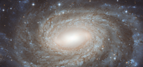

# Preview of potw1108a: "Perfect spiral overlaid with Milky Way gems"
[https://www.spacetelescope.org/images/potw1108a/](https://www.spacetelescope.org/images/potw1108a/)

The NASA/ESA Hubble Space Telescope has produced this finely detailed image of the beautiful spiral galaxy NGC 6384. This galaxy lies in the constellation of Ophiuchus (The Serpent Bearer), not far from the centre of the Milky Way on the sky. The positioning of NGC 6384 means that we have to peer at it past many dazzling foreground Milky Way stars that are scattered across this image. In 1971, one member of NGC 6384 stood out against these bright foreground stars when one of its stars exploded as a supernova. This was a Type Ia supernova, which occurs when a compact star that has ceased fusion in its core, called a white dwarf, increases its mass beyond a critical limit by gobbling up matter from a companion star. A runaway nuclear explosion then makes the star suddenly as bright as a whole galaxy. While many stars have already come to the ends of their lives in NGC 6384, in the centre, star formation is being fuelled by the galaxy’s bar structure; astronomers think such galactic bars funnel gas inwards, where it accumulates to form new stars. This picture was created from images take with the Wide Field Channel of Hubble’s Advanced Camera for Surveys. An image taken through a blue filter (F435W, coloured blue) was combined with an image taken through a near-infrared filter (F814W, coloured red). The total exposure times were 1050 s through each filter and the field of view is about 3 x 1.5 arcminutes.