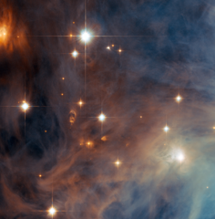

# Preview of potw1109a: "Orion’s lesser-known nebula takes centre stage"
[https://www.spacetelescope.org/images/potw1109a/](https://www.spacetelescope.org/images/potw1109a/)

The NASA/ESA Hubble Space Telescope has taken a close-up view of an outer part of the Orion Nebula’s little brother, Messier 43. This nebula, which is sometimes referred to as De Mairan’s Nebula after its discoverer, is separated from the famous Orion Nebula (Messier 42) by only a dark lane of dust. Both nebulae are part of the massive stellar nursery called the Orion molecular cloud complex, which includes several other nebulae, such as the Horsehead Nebula (Barnard 33) and the Flame Nebula (NGC 2024). The Orion molecular cloud complex is about 1400 light-years away, making it one of the closest massive star formation regions to Earth. Hubble has therefore studied this extraordinary region extensively over the past two decades, monitoring how stellar winds sculpt the clouds of gas, studying young stars and their surroundings and discovering many elusive objects, such as brown dwarf stars. This view shows several of the brilliant hot young stars in this less-studied region and it also reveals many of the curious features around even younger stars that are still cocooned by dust. This picture was created from images taken using the Wide Field Channel of Hubble’s Advanced Camera for Surveys. Images through yellow (F555W, coloured blue) and near-infrared (F814W, coloured red) filters were combined. The exposure times were 1000 s per filter and the field of view is about 3.3 arcminutes across.