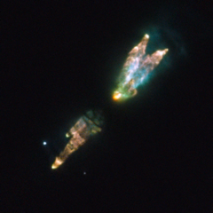

# Preview of potw1110a: "A dying star’s toxic legacy"
[https://www.spacetelescope.org/images/potw1110a/](https://www.spacetelescope.org/images/potw1110a/)

The strange and irregular bundle of jets and clouds in this curious image from the NASA/ESA Hubble Space Telescope is the result of a burst of activity late in the life of a star. As its core runs out of nuclear fuel, the star’s unstable outer layers are puffing out a toxic concoction of gases including carbon monoxide and hydrogen cyanide. The Westbrook Nebula — also known as PK166-06, CRL 618 and AFGL 618 — is a protoplanetary nebula, an opaque, dark and relatively short-lived cloud of gas that is ejected by a star as it runs out of nuclear fuel. As the star hidden deep in the centre of the nebula evolves further it will turn into a hot white dwarf and the gas around it will become a glowing planetary nebula, before eventually dispersing. Because this is a relatively brief stage in the evolution process of stars, only a few hundred protoplanetary nebulae are known in the Milky Way. Protoplanetary nebulae are cool, and so emit little visible light. This makes them very faint, posing challenges to scientists who wish to study them. What this picture shows, therefore, is a composite image representing the different tricks that the astronomers used to unravel what is going on within this strange nebula. The picture includes exposures in visible light which shows light reflected from the cloud of gas, combined with other exposures in the near-infrared part of the spectrum, showing us the dim glow, invisible to human eyes, that is coming from different elements deep in the cloud itself. One of the nebula’s names, AFGL 618, comes from its discovery by a precursor to the Hubble Space Telescope: the letters stand for Air Force Geophysics Laboratory. This US research organisation launched a series of suborbital rockets with infrared telescopes on board in the 1970s, cataloguing hundreds of objects that were impossible or difficult to observe from the ground. In some respects, these were a proof of concept for later orbital infrared astronomical facilities including Hubble and ESA’s Herschel Space Observatory. This image was prepared from many separate exposures taken using Hubble’s newest camera, the Wide Field Camera 3. Exposures through a green filter (F547M) were coloured blue, those through a yellow/orange filter (F606W) were coloured green and exposures through a filter that isolates the glow from ionised nitrogen (F658N) have been coloured red. Images through filters that capture the glows from singly and doubly ionised sulphur (F673N and F953N) are also shown in red. The total exposure times were about nine minutes through each filter and the field of view is approximately 20 arcseconds across. Links  A previous ESA/Hubble release of a WFPC2 shot of the Westbrook Nebula: http://www.spacetelescope.org/news/heic0004/ 