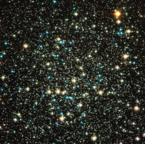

# Preview of potw1111a: "Family of stars breaking up"
[https://www.spacetelescope.org/images/potw1111a/](https://www.spacetelescope.org/images/potw1111a/)

Most of the rich globular star clusters that orbit the Milky Way have cores that are tightly packed with stars, but NGC 288 is one of a minority of low-concentration globulars, with its stars more loosely bound together. This new image from the Advanced Camera for Surveys on the NASA/ESA Hubble Space Telescope completely resolves the old stars at the core of the cluster. The colours and brightnesses of the stars in the picture tell the story of how the stars have evolved in the cluster. The many fainter points of light are normal low-mass stars that are still fusing hydrogen in the same way as the Sun. The brighter stars fall into two classes: the yellow ones are red giant stars that are at a later phase in their careers and are now bigger, cooler and brighter. The bright blue stars are even more massive stars that have left the red giant phase and are being powered by helium fusion in their cores. The stars within globular clusters form at about the same time from the same cloud of gas, making these close families of stars. However, astronomers think that the stellar siblings in low-concentration globular clusters such as NGC 288, which are not so tightly bound together by gravity as richer and denser clusters, may eventually disperse and go their separate ways. NGC 288 is found within the rather obscure southern constellation of Sculptor, at a distance of about 30 000 light-years. This constellation also contains NGC 253, more commonly called the Sculptor Galaxy due to its location, and these two deep sky objects are close enough together on the sky to be observed in the same binocular field of view. William Herschel first spotted NGC 288 in 1785 and also recognised that it was a globular cluster that could be resolved into stars in his telescope. This picture was created from Hubble images taken using the Wide Field Channel of the Advanced Camera for Surveys through four different filters. Light recorded through a blue filter (F435W) is coloured blue, light through an orange filter (F606W) appears as green, light coming through a near-infrared filter (F814W) is red and finally the light from glowing hydrogen (F658N) is orange. The exposure times were 740 s, 530 s, 610 s and 1760 s respectively and the field of view is 3.2 arcminutes across.