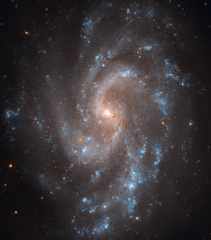

# Preview of potw1112a: "Spiral key to Universe's expansion"
[https://www.spacetelescope.org/images/potw1112a/](https://www.spacetelescope.org/images/potw1112a/)

This view from the NASA/ESA Hubble Space Telescope shows the beautiful spiral galaxy NGC 5584. This galaxy has played a key role in a new study that measures the expansion rate of the Universe to greater accuracy than ever before. NGC 5584 was first spotted as a faint glow in the constellation of Virgo by the great visual observer E. E. Barnard, back in 1881, using just a 12.5-cm telescope. But, by bringing the power of Hubble to bear, the galaxy can be resolved into thousands of separate stars. Some of these stars vary in brightness and are classified as Cepheids. These are brilliant pulsating stars with a remarkable property — once the time it takes a Cepheid to brighten and fade is known, then it is possible to find how bright it actually is. When this information is combined with a measurement of how bright the star appears it is easy to work out how far away the star actually lies. This method is the most accurate and effective way to measure the distances to most nearby galaxies. This trick has now been used as part of a major new study of the expansion rate of the Universe, led by Adam Riess at the Space Telescope Science Institute in Baltimore. By studying many Cepheids in several galaxies the team has been able to refine our knowledge of this expansion rate, expressed as a number known as Hubble’s constant, to an accuracy of 3.3 percent. In addition to many Cepheids NGC 5584 was also recently the site of a type Ia supernova. These dramatic explosions of white dwarf stars are used as reference beacons for mapping the expansion, and acceleration, of the more remote Universe so this galaxy is a very valuable link between the two distance scales. More details of this major study, and its significance for the understanding of dark energy, can be found in a press release from NASA: https://hubblesite.org/contents/news-releases/2011/news-2011-08.html. This picture was created from many exposures taken with Hubble’s Wide Field Channel 3. Images through three filters have been combined to create this composite picture. Light detected through a filter that transmits most visible light (F350LP) is coloured white, light coming through a yellow/green filter (F555W) is coloured blue and near infrared light (the F814W filter) is coloured red. The field of view 2.4 arcminutes across and the total exposure time was 20.8 hours.