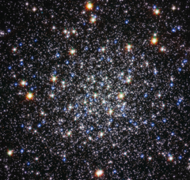

# Preview of potw1113a: "Cluster’s deceptive serenity hides violent past"
[https://www.spacetelescope.org/images/potw1113a/](https://www.spacetelescope.org/images/potw1113a/)

The high concentration of stars within globular clusters, like Messier 12, shown here in an image from the NASA/ESA Hubble Space Telescope, makes them beautiful photographic targets. But the cramped living quarters in these clusters also makes them home to exotic binary star systems where two stars are locked in tight orbits around each other and matter from one is gobbled up by its companion, releasing X-rays. It is thought that such X-ray binaries form from very close encounters between stars in crowded regions, such as globular clusters, and even though Messier 12 is fairly diffuse by globular cluster standards, such X-ray sources have been spotted there. Astronomers have also discovered that Messier 12 is home to far fewer low-mass stars than was previously expected (eso0604). In a recent study, astronomers used the European Southern Observatory’s Very Large Telescope at Cerro Paranal, Chile, to measure the brightness and colours of more than 16 000 of the globular’s 200 000 stars. They speculate that nearly one million low-mass stars have been ripped away from Messier 12 as the globular has passed through the densest regions of the Milky Way during its orbit around the galactic centre. It seems that the serenity of this view of Messier 12 is misleading and the object has had a violent and disturbed past. Messier 12 lies about 23 000 light-years away in the constellation of Ophiuchus (The Serpent Bearer). This image was taken using the Wide Field Channel of Hubble’s Advanced Camera for Surveys. The colour image was created from exposures through a blue filter (F435W, coloured blue), a red filter (F625W, coloured green) and a filter that passes near-infrared light (F814W coloured red). The total exposure times were 1360 s, 200 s and 364 s, respectively. The field of view is about 3.2 x 3.1 arcminutes .