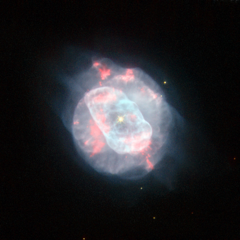

# Preview of potw1114a: "The beauty of asymmetry"
[https://www.spacetelescope.org/images/potw1114a/](https://www.spacetelescope.org/images/potw1114a/)

The NASA/ESA Hubble Space Telescope has captured a planetary nebula with unconventional good looks. Planetary nebulae signal the demise of mid-sized stars (up to about eight times the mass of the Sun); when the star’s hydrogen fuel supply is exhausted, its outer layers expand and cool, creating a cocoon of gas and dust. This gas then glows as it is bathed in the strong ultraviolet radiation from the central star. NGC 5882 is a quite bright, but small, example of a planetary nebula that lies deep in the southern Milky Way in the constellation of Lupus (The Wolf). Planetary nebulae sometimes have a perfectly symmetrical appearance, with gas being bellowed out from the dying star evenly in every direction. However, this isn’t the case for NGC 5882, as this Hubble image shows. It appears to have two distinct, but non-uniform regions: an elongated inner shell of gas and a fainter aspherical shell that surrounds it. Hubble’s sharp view reveals the intricate knots, filaments and bubbles within these shells. But it’s the dying star at the heart of the planetary nebula that dominates the image, shining brightly with an incredible surface temperature of about 70 000 degrees Celsius. (For comparison, the surface temperature of the Sun is only about 5500 degrees Celsius.) The high surface temperature of this white dwarf is a result of the star’s struggle for survival, finding new ways to prevent itself from collapsing under its own gravity. This image is dedicated to all ESA/Hubble Facebook friends on the occasion of our Facebook page reaching 50 000 friends. If you want to be fascinated every week by awe-inspiring photos of the Universe, stay in touch with the most recent discoveries from Hubble, find out about our competitions and events or simply get in touch with people that share the same curiosity about the Universe, join us on Facebook.  This picture comes from images taken with Hubble’s Wide Field Planetary Camera 2. Light that comes from glowing ionised oxygen is coloured blue (through the F502N filter), yellow/green light (through the broad F555W filter) is shown as green, the light from glowing hydrogen (through the F656N filter) is shown as dark red and light from glowing nitrogen is shown as bright red (through the F658N filter). The exposure times were 320 s, 104 s, 140 s and 1200 s, respectively and the field of view is just 29 arcseconds across.